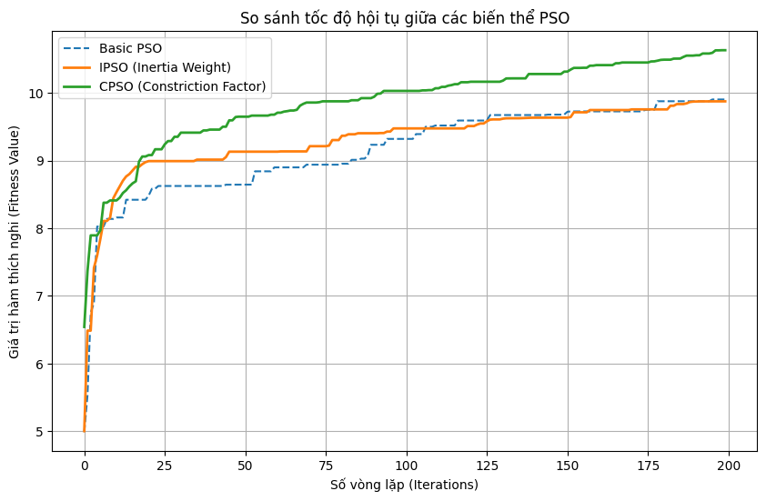

# 📡 6G/JCAS Optimization using Particle Swarm Optimization (PSO)

  <h3>
    <a href="#jp">🇯🇵 日本語 (Japanese)</a> | 
    <a href="#vn">🇻🇳 Tiếng Việt (Vietnamese)</a> |
    <a href="#en">🇺🇸 English</a>
  </h3>

---

## 🇯🇵 日本語: プロジェクト概要 (Project Overview)

> **概要 (Summary)**
> 次世代通信規格 (6G) および自動運転 (SDV) における重要技術である「通信とセンシングの融合 (JCAS)」をテーマにした、独自実装による最適化アルゴリズムの研究開発プロジェクトです。

### 1. 背景・課題 (Context)
自動運転車の普及に伴い、車両は通信(V2X)と周辺検知(Radar)を同時に行う必要があります。これらを別々のハードウェアで行うのは非効率です。
本プロジェクトでは、**JCAS (Joint Communication and Sensing)** 技術を用い、単一のアンテナアレイで通信とレーダー機能を両立させる際の「干渉問題」を、数学的アプローチ（PSO）で解決しました。

### 2. 技術的こだわり (Engineering Highlights)
* **スクラッチ実装 (Scratch Implementation):** ライブラリに頼らず、アルゴリズムの数式を Python/NumPy でゼロから実装し、計算ロジックを深く理解しています。
* **ドキュメンテーション:** LaTeXを用いて数式や理論背景を詳細に記述した報告書を作成しました。
* **アルゴリズム改良:** 基本的なPSOの「早期収束」問題を解決するため、**CPSO (Constriction Factor)** を導入し、サイドローブ（干渉）を **-35dB** まで抑制することに成功しました。

### 3. 主な成果 (Key Results)
* **収束性能:** 改良版アルゴリズム(CPSO)により、探索速度と解の精度を大幅に向上。
* **干渉抑制:** ユーザー方向への通信品質を維持しつつ、レーダーターゲット以外への電波干渉を最小化。

📥 **詳細レポート (PDF/ベトナム語):** [Báo cáo bài tập lớn NMKTTT - Nhóm 33.pdf](Báo%20cáo%20bài%20tập%20lớn%20NMKTTT%20-%20Nhóm%2033.pdf)

---

## 🇻🇳 Tiếng Việt: Báo cáo Project

**Đại học Bách Khoa Hà Nội | Trường Công nghệ Thông tin và Truyền thông**
**Môn học:** Nhập môn Kỹ thuật truyền thông

### 👥 Thành viên & Vai trò (Project Team)
| Thành viên | MSSV | Vai trò & Trách nhiệm |
|:---|:---:|:---|
| **Nguyễn Khánh Toàn** | **20235847** | **Project Lead & Main Developer** *(Thiết kế thuật toán, Lập trình Python/C++, Viết báo cáo)* |
| Trần Việt Gia Khánh | 20235756 | **Research Assistant** *(Hỗ trợ chạy mô phỏng, Tổng hợp số liệu)* |

### 📖 Giới thiệu đề tài
Đề tài tập trung giải quyết bài toán tối ưu hóa đa chùm tia (Multibeam) cho hệ thống JCAS. Mục tiêu là tìm ra bộ trọng số búp sóng $\mathbf{W}$ sao cho:
1.  **Max Sum Rate:** Tối đa hóa tốc độ dữ liệu cho người dùng.
2.  **Max Sensing Gain:** Tối đa hóa khả năng phát hiện mục tiêu Radar.
3.  **Min Sidelobe:** Nén búp sóng phụ xuống thấp nhất để giảm nhiễu.

### 📊 Kết quả mô phỏng (Simulation Results)

#### 1. So sánh tốc độ hội tụ
Biểu đồ so sánh giá trị hàm thích nghi (Fitness) giữa 3 thuật toán. CPSO (màu xanh lá) cho thấy khả năng hội tụ nhanh và đạt giá trị Fitness cao nhất (>10.5).

#### 2. Đồ thị búp sóng (Beampattern)
Kết quả tạo búp sóng của thuật toán tốt nhất (CPSO).
* **User (-30°, 10°):** Đỉnh búp sóng cao (ưu tiên truyền thông).
* **Target (40°):** Đỉnh búp sóng rõ ràng.
* **Nhiễu (Sidelobe):** Được nén xuống rất thấp (-35dB) ở các vùng không mong muốn.

📥 **Tải báo cáo đầy đủ (PDF):** [Báo cáo bài tập lớn NMKTTT - Nhóm 33.pdf](Báo%20cáo%20bài%20tập%20lớn%20NMKTTT%20-%20Nhóm%2033.pdf)

### 🛠️ Hướng dẫn cài đặt & Chạy code
Dự án yêu cầu **Python 3.8+**.

#### Bước 1: Cài đặt thư viện
~~~bash
pip install -r requirements.txt
~~~

#### Bước 2: Chạy mô phỏng chính (Python)
~~~bash
cd src/python
python jcas_pso.py
~~~
*Chương trình sẽ tự động chạy 3 thuật toán (Basic PSO, IPSO, CPSO) và xuất ra biểu đồ so sánh.*

#### Bước 3: Chạy kiểm thử thuật toán (C++)
~~~bash
cd src/cpp_tests
g++ PSOtest.cpp -o pso_test
./pso_test
~~~

---

## 🇺🇸 English: Technical Summary

### Project Description
This project implements **Particle Swarm Optimization (PSO)** algorithms to optimize beamforming weights in a **Joint Communication and Sensing (JCAS)** system. It addresses the challenge of multi-objective optimization in 6G networks, balancing communication data rates with radar sensing accuracy.

### Tech Stack
* **Language:** Python (Simulation), C++ (Algorithm Core).
* **Documentation:** LaTeX (Report generation).
* **Techniques:** Meta-heuristic Optimization, Digital Signal Processing (DSP), Antenna Array Processing.

### Directory Structure
~~~text
JCAS-PSO-Optimization/
├── src/
│   ├── python/        # JCAS Simulation Source Code
│   └── cpp_tests/     # C++ Algorithm Verification
├── results/           # Output Images & Graphs
├── requirements.txt   # Python Dependencies
├── Báo cáo...pdf      # Full Report (Vietnamese/LaTeX)
└── README.md          # Project Documentation
~~~

---
*© 2026 JCAS-PSO-Optimization - Hanoi University of Science and Technology*
